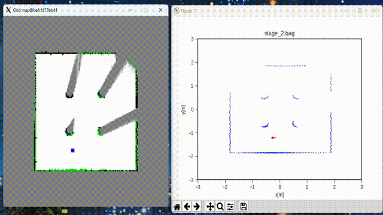
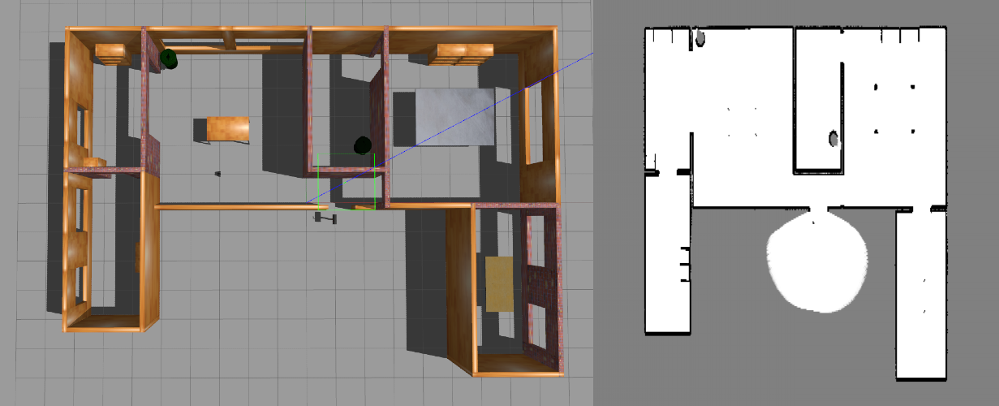
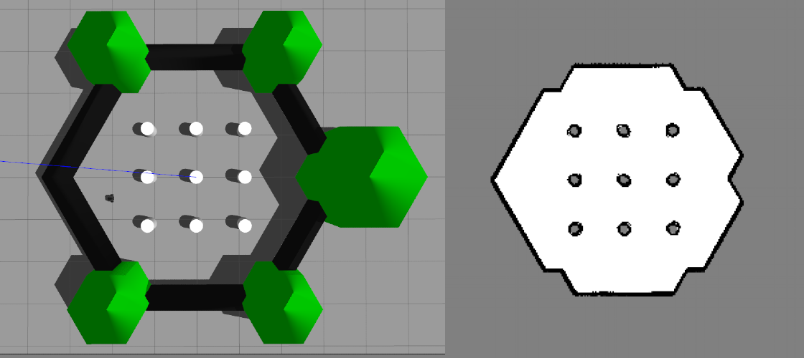

# Grid Mapping with ROS Noetic

This repository provides a **ROS Noetic**-based implementation for grid mapping using Docker. It includes scripts and tools for creating occupancy grid maps from ROS bag files.


### 📂 1. Repository Structure

```
grid_mapping_noetic/
│── bagfiles/             # Example ROS bag files
│── CMakeLists.txt        # Catkin build configuration
│── Dockerfile            # Docker build file (optional)
│── figures/              # Generated occupancy grid maps
│── package.xml           # ROS package manifest
│── papers/               # Related research papers
│── README.txt            # Original notes
│── scripts/              # Python mapping scripts
│   ├── bresenham.py
│   ├── create_from_rosbag.py
│   ├── grid_map.py
│   ├── message_handler.py
│   ├── rtime_gmapping_node.py
│   ├── utils.py
│   └── __pycache__/
```

---


### 📦 2. Clone this repository
```bash
cd <path_of_workspace>
git clone git@github.com:Wangzhaoze/grid_mapping_noetic.git
```

---
### ⚙️ 3. Setup using Docker

#### 3.1. Allow X11 access for Docker

To visualize GUI applications inside Docker, you need to configure X11 access.

- **On Linux**
```bash
xhost +local:docker
```

- **On Windows**
1. Install [VcXsrv](https://sourceforge.net/projects/vcxsrv/).
2. Configure VcXsrv with the following settings:
   - **Display settings**: Multiple windows  
   - **Display number**: `0`  
   - **Client startup**: Start no client  
   - **Extra settings**: Enable `Disable access control`  
3. In PowerShell, set the `DISPLAY` environment variable:
   ```powershell
   $env:DISPLAY="host.docker.internal:0.0"
   ```

#### 3.2. Docker Image
##### (Option 1): Pull and Run the Docker Container
Download docker image directly from DockerHub:
```powershell
docker pull wangzhaoze/grid_mapping_noetic:1.0
```

##### (Option 2): Build and Run the Docker Container
Build the Docker image:
```powershell
docker build -t grid_mapping_noetic .
```

#### 3.3. Run the container:
```powershell
docker run -it -e DISPLAY=$env:DISPLAY grid_mapping_noetic
```

> ⚠️ Note: The `-v /tmp/.X11-unix:/tmp/.X11-unix` volume mount is only required on Linux.  
> On Windows, this option should be omitted.

---

### 4. Run the Application
Inside the container, execute:
```bash
rosrun grid_mapping create_from_rosbag.py
```

If everything is set up correctly, you should see the following visualization windows:



---

## 🖼️ 5. Examples

Example maps overview and generated grid map:

- **House map**



- **World map**


---

## 📖 References

- ROS Noetic documentation: [noetic](http://wiki.ros.org/noetic)
- Occupancy grid mapping concepts
