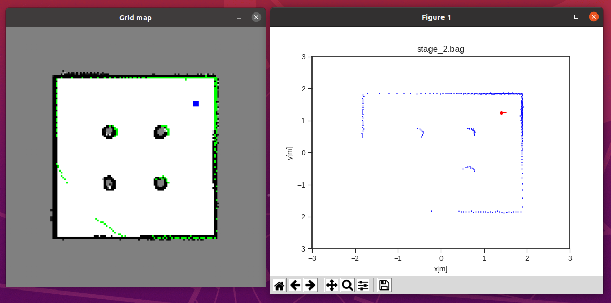

# Grid Mapping with ROS Noetic

This repository provides a **ROS Noetic**-based implementation for grid mapping using Docker. It includes scripts and tools for creating occupancy grid maps from ROS bag files.


### 📂 1. Repository Structure

```
grid_mapping_noetic/
│── bagfiles/             # Example ROS bag files
│── bagfiles.zip          # Compressed bag files
│── CMakeLists.txt        # Catkin build configuration
│── Dockerfile            # Docker build file (optional)
│── maps/                 # Generated occupancy grid maps
│── package.xml           # ROS package manifest
│── papers/               # Related research papers
│── README.txt            # Original notes
│── scripts/              # Python mapping scripts
│   ├── bresenham.py
│   ├── create_from_rosbag.py
│   ├── grid_map.py
│   ├── message_handler.py
│   ├── rtime_gmapping_node.py
│   ├── utils.py
│   └── __pycache__/
```

---


### 📦 2. Clone this repository
```bash
cd <path_of_workspace>
git clone git@github.com:Wangzhaoze/grid_mapping_noetic.git
```

---
### ⚙️ 3.1. Setup Instructions using Docker

#### 3.1.1. Allow X11 access for Docker
```bash
xhost +local:docker
```

#### 3.1.2. Pull ROS Noetic Docker image
```bash
docker pull ros:noetic
```

#### 3.1.3. Run the Docker container
```bash
docker run -it \
    --name grid_mapping_noetic \
    --net=host \
    --env="DISPLAY=$DISPLAY" \
    --env="QT_X11_NO_MITSHM=1" \
    --volume="/tmp/.X11-unix:/tmp/.X11-unix:rw" \
    --volume="$(pwd)/grid_mapping_noetic/:/root/catkin_ws/src/grid_mapping_noetic/" \
    ros:noetic
```

#### ---- From Here Inside the Container ----
#### 3.1.4. Setup Catkin workspace
```bash
cd ~/catkin_ws/
rosdep update
rosdep install --from-paths src --ignore-src -r -y
```

#### 3.1.5. Install dependencies
```bash
apt update
apt install -y python3-pip python3-opencv python3-matplotlib
pip3 install numpy
apt install ros-noetic-tf -y
```

#### 3.1.6. Configure ROS environment
```bash
echo "source /opt/ros/noetic/setup.bash" >> ~/.bashrc
source ~/.bashrc
```

#### 3.1.7. Build the workspace
```bash
catkin_make
source devel/setup.bash
```

#### 3.1.8. Make scripts executable
```bash
chmod +x src/grid_mapping_noetic/scripts/create_from_rosbag.py
```

#### 3.1.9. Run the mapping script
Filnally, run this code: 
```bash
rosrun grid_mapping create_from_rosbag.py
```
Then you should see these windows:



---


## 🖼️ 4. Examples

Example maps overview and generated grid map:

- **House map**


- **World map**


---

## 📖 References

- ROS Noetic documentation: [http://wiki.ros.org/noetic](http://wiki.ros.org/noetic)
- Occupancy grid mapping concepts
