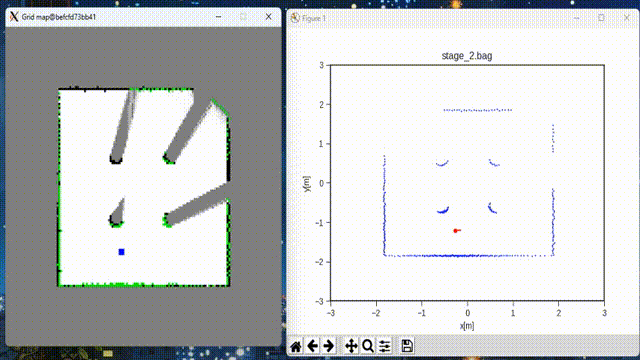

### 📦 1. Clone this repository
```bash
cd <path_of_workspace>
git clone git@github.com:Wangzhaoze/grid_mapping_noetic.git
```

---
### ⚙️ 2. Setup Instructions using Docker

#### 2.1. Allow X11 access for Docker
- In Linux
```bash
xhost +local:docker
```

- In Windows:
```
install [VcXsrv](https://sourceforge.net/projects/vcxsrv/)
Display settings: Multiple windows
Display number: 0
Client startup: Start no client
Extra settings: Select Disable access control
(In PowerShell): $env:DISPLAY="host.docker.internal:0.0"
```

#### 2.2. Pull ROS Noetic Docker image
```bash
docker pull ros:noetic
```

#### 2.3. Run the Docker container
```bash
docker run -it \
    --name grid_mapping_noetic \
    --net=host \
    --env="DISPLAY=$DISPLAY" \
    --env="QT_X11_NO_MITSHM=1" \
    --volume="/tmp/.X11-unix:/tmp/.X11-unix:rw" \
    --volume="$(pwd)/grid_mapping_noetic/:/root/catkin_ws/src/grid_mapping_noetic/" \
    ros:noetic
```

#### ---- From Here Inside the Container ----
#### 2.4. Setup Catkin workspace
```bash
cd ~/catkin_ws/
rosdep update
rosdep install --from-paths src --ignore-src -r -y
```

#### 2.5. Install dependencies
```bash
apt update
apt install -y python3-pip python3-opencv python3-matplotlib
pip3 install numpy
apt install ros-noetic-tf -y
```

#### 2.6. Configure ROS environment
```bash
echo "source /opt/ros/noetic/setup.bash" >> ~/.bashrc
source ~/.bashrc
```

#### 2.7. Build the workspace
```bash
catkin_make
source devel/setup.bash
```

#### 2.8. Make scripts executable
```bash
chmod +x src/grid_mapping_noetic/scripts/create_from_rosbag.py
```

#### 2.9. Run the mapping script
Filnally, run this code: 
```bash
rosrun grid_mapping create_from_rosbag.py
```
Then you should see these windows:



---